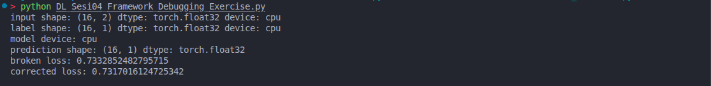
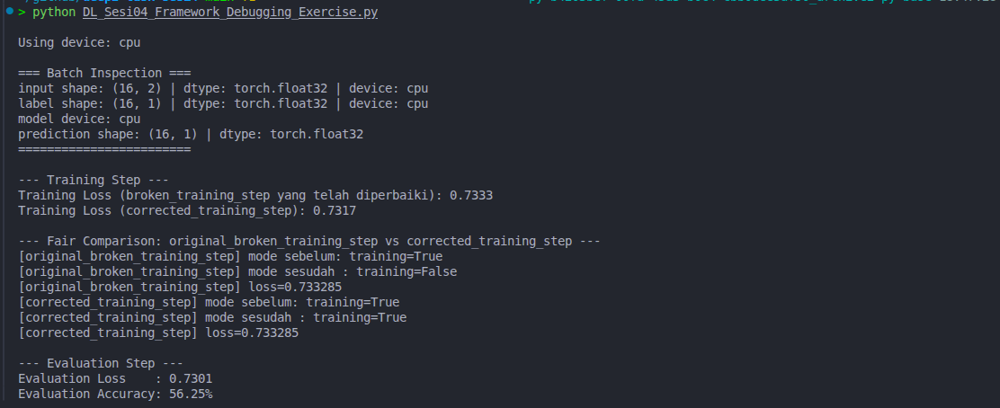

# Tugas Praktik Deep Learning — Sesi 4: Framework Debugging Exercise

Repositori ini berisi pengerjaan tugas praktik mata kuliah **Deep Learning (SDA2110)** mengenai *Framework Debugging*, mekanisme operasional PyTorch (*training* vs *evaluation mode*), Autograd, tensor mechanics, dan evaluasi model klasifikasi biner.

---

## 👥 Identitas Kelompok

**Kelompok 5**

| No. | Nama Lengkap | NIM / ID | Peran |
|:---:|:---|:---:|:---:|
| 1 | **Tita Noviana** | 24120500011 | Ketua |
| 2 | **Titanio Yudista** | 24120500031 | Anggota |
| 3 | **Suci Fransisca Sisilia R** | 24120500008 | Anggota |
| 4 | **Fajar Dwiharjo** | 24130500010 | Anggota |
| 5 | **Rafli Ramadhan** | 24130500001 | Anggota |

---

## 📌 Deskripsi Tugas

Tugas ini bertujuan untuk melatih pemahaman mengenai alur kerja internal framework PyTorch, khususnya dalam:
1. Mengidentifikasi dan memperbaiki *silent logic bug* pada siklus pelatihan (*training loop*).
2. Memahami perbedaan fundamental antara mode `model.train()` dan `model.eval()`, serta dampaknya pada layer seperti `Dropout` dan `BatchNorm`.
3. Membedakan peran `model.eval()` (level modul) dan `torch.no_grad()` (level autograd engine).
4. Menganalisis mekanika tensor: kesesuaian *shape* `(16, 1)`, tipe data `torch.float32`, sinkronisasi *device* (CPU/GPU), dan kestabilan numerik `nn.BCEWithLogitsLoss()`.
5. Membangun fungsi evaluasi modular `evaluate_step()` untuk mengukur loss dan akurasi klasifikasi biner.

---

## 📁 Struktur Direktori

```text
deep2-task-sesi4/
│
├── DL_Sesi04_Framework_Debugging_Exercise.py  # Script Python utama (perbaikan kode & fungsi evaluasi)
├── jawaban.md                                # Lembar jawaban lengkap untuk pertanyaan Bagian A s.d. E
├── ANALYSIS.md                               # Dokumen analisis teknis mendalam arsitektur PyTorch
├── DL004.pdf                                 # Panduan soal & rubrik tugas Sesi 4
├── output.txt                                # Log hasil eksekusi program
├── screenshot/                               # Bukti tangkapan layar eksekusi program
│   ├── before-fix.png                        # Tangkapan layar sebelum perbaikan
│   └── hasil_program.png                     # Tangkapan layar setelah perbaikan dan evaluasi
├── README.md                                 # Dokumentasi utama proyek
└── LICENSE                                   # Lisensi proyek (MIT)
```

---

## 🛠️ Ringkasan Temuan & Perbaikan

### 1. Perbaikan Bug `broken_training_step()`
* **Masalah**: Fungsi pelatihan sebelumnya memanggil `model.eval()`, yang mematikan mode latihan untuk semua submodul.
* **Dampak**: Menonaktifkan efek regularisasi pada layer seperti `Dropout` dan membekukan pembaruan statistik pada layer `BatchNorm`.
* **Solusi**: Mengubah `model.eval()` menjadi `model.train()` pada `corrected_training_step()` agar seluruh parameter dan layer belajar sebagaimana mestinya.

### 2. Disiplin Mode Evaluasi & Autograd
* `model.eval()` **tidak menghentikan** perhitungan gradien.
* Untuk fase evaluasi yang optimal dan hemat memori, proses *forward pass* wajib dibungkus di dalam blok `with torch.no_grad():`.

### 3. Penyelarasan Tensor
* **Shape `(16, 1)`**: Disesuaikan dengan output layer terakhir `nn.Linear(8, 1)` agar tidak terjadi error dimensi atau *unintended broadcasting* pada `nn.BCEWithLogitsLoss()`.
* **Dtype `float32`**: Label biner dikonversi dari integer (`torch.int64`) ke floating-point (`.float()`) untuk kompatibilitas perhitungan Binary Cross-Entropy.

---

## 🚀 Cara Menjalankan Program

### Prasyarat
Pastikan sistem telah terpasang Python 3.8+ dan PyTorch:
```bash
python --version
pip install torch
```

### Menjalankan Skrip
Jalankan file latihan debugging melalui terminal:
```bash
python DL_Sesi04_Framework_Debugging_Exercise.py
```

---

## 📊 Hasil Eksekusi Program

### 1. Sebelum Perbaikan (*Before Fix*)
Keluaran terminal awal sebelum skrip dirapikan dan sebelum penambahan modul fungsi evaluasi:

```text
input shape: (16, 2) dtype: torch.float32 device: cpu
label shape: (16, 1) dtype: torch.float32 device: cpu
model device: cpu
prediction shape: (16, 1) dtype: torch.float32
broken loss: 0.7332852482795715
corrected loss: 0.7317016124725342
```



---

### 2. Sesudah Perbaikan & Penambahan Evaluasi (*After Fix*)
Keluaran terminal setelah perbaikan mode pelatihan (`model.train()`), perapihan format batch inspection, dan penambahan implementasi fungsi `evaluate_step()`:

```text
Using device: cpu

=== Batch Inspection ===
input shape: (16, 2) | dtype: torch.float32 | device: cpu
label shape: (16, 1) | dtype: torch.float32 | device: cpu
model device: cpu
prediction shape: (16, 1) | dtype: torch.float32
========================

--- Training Step ---
Training Loss (broken_training_step yang telah diperbaiki): 0.7333
Training Loss (corrected_training_step): 0.7317

--- Fair Comparison: original_broken_training_step vs corrected_training_step ---
[original_broken_training_step] mode sebelum: training=True
[original_broken_training_step] mode sesudah : training=False
[original_broken_training_step] loss=0.733285
[corrected_training_step] mode sebelum: training=True
[corrected_training_step] mode sesudah : training=True
[corrected_training_step] loss=0.733285

--- Evaluation Step ---
Evaluation Loss    : 0.7301
Evaluation Accuracy: 56.25%
```



---

## 📄 Lisensi

Proyek ini dilisensikan di bawah [MIT License](file:///home/titan/github/deep2-task-sesi4/LICENSE).
